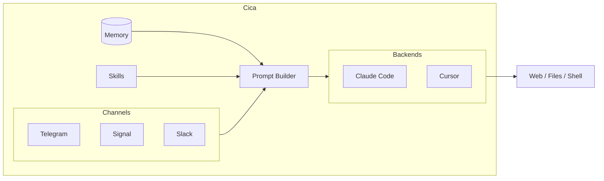

# Cica

An agentic personal assistant that lives in your chat.

Cica brings Claude's capabilities to your messaging apps. It can hold conversations, answer questions, search the web, run commands, read and write files, and learn new skills over time.

## Features

- **Multi-channel**: Chat via Telegram, Signal, or Slack
- **Multi-user**: Each user gets their own agent identity and memory, while skills are shared
- **Continuous conversations**: Conversations persist across messages, so context is maintained
- **Memory**: Remembers important things about you across conversations
- **Skills**: Extensible through custom skills you build together
- **Self-contained**: All dependencies are managed locally, nothing is installed globally

## Requirements

- macOS (Apple Silicon) or Linux
- Claude Code subscription or Anthropic API key

## Installation

```bash
curl -fsSL https://raw.githubusercontent.com/oxideai/cica/main/install.sh | sh
```

Or with Cargo:

```bash
cargo install --git https://github.com/oxideai/cica
```

## Building from Source

```bash
git clone https://github.com/oxideai/cica
cd cica
cargo build --release
./target/release/cica
```

## Getting Started

```bash
# Run setup wizard
cica init

# Start the assistant
cica
```

## Usage

Once running, message your bot on Telegram, Signal, or Slack. On first contact, you'll go through a quick pairing flow, then Cica will learn who it is and who you are.

```bash
# Approve a new user
cica approve <pairing-code>

# Show where data is stored
cica paths
```

## Architecture



## License

Licensed under either of Apache License, Version 2.0 or MIT license at your option.
